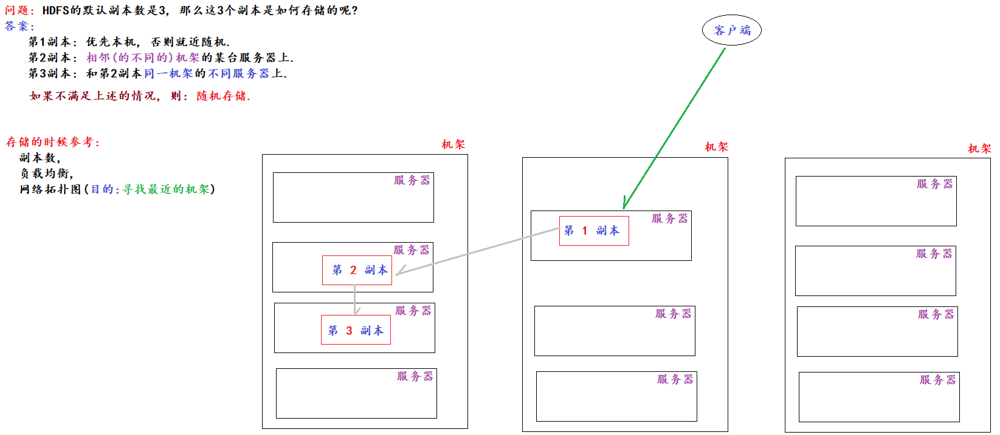

### 一、HDFS简介

```shell
hdfs简介
  全称Hadoop Distributed File System，是Hadoop框架的一个组件，用于实现分布式存储。
  即：HDFS是大数据分布式存储文件系统，可以存储海量数据。
HDFS存储思路
  由Client（客户端）对文件进行切块（默认128MB/块，可修改），然后由namenode分配到不同的datanode上存储。
HDFS组件的角色划分
  HDFS Client
    负责文件切分
    负责和namenode、datanode交互
    负责副本策略，集群的启动和关闭
  namenode
    1.管理整个HDFS集群
    2.维护和管理元数据
  SecondaryNameNode
    辅助namenode管理元数据
  datanode
    负责具体数据（块）的存储
    负责数据的读写操作
    定时向namenode汇报自己的块信息
HDFS的适用场景
  1.存储海量的大文件
  2.对数据的时效性要求相对较低
  3.一次写入，多次读取
  4.随机读写要求相对较低
```

### 二、namenode如何管理datanode


### 三、HDFS默认的3副本数是如何存储


